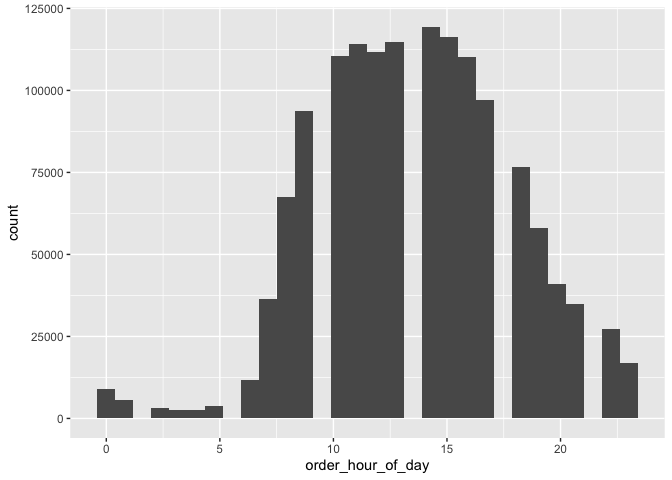
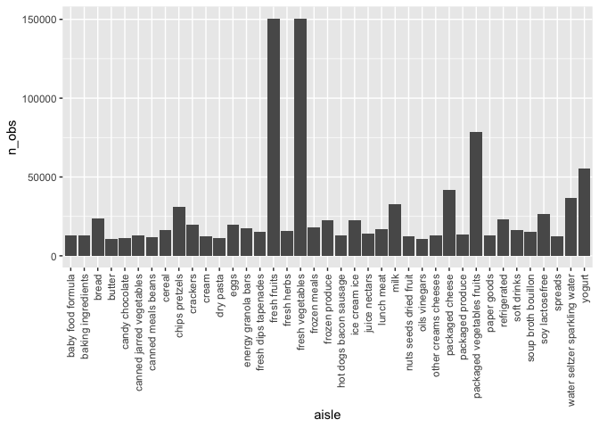

p8105_hw3_co2616
================
2025-10-13

``` r
library(tidyverse)
```

    ## ── Attaching core tidyverse packages ──────────────────────── tidyverse 2.0.0 ──
    ## ✔ dplyr     1.1.4     ✔ readr     2.1.5
    ## ✔ forcats   1.0.0     ✔ stringr   1.5.1
    ## ✔ ggplot2   3.5.2     ✔ tibble    3.3.0
    ## ✔ lubridate 1.9.4     ✔ tidyr     1.3.1
    ## ✔ purrr     1.1.0     
    ## ── Conflicts ────────────────────────────────────────── tidyverse_conflicts() ──
    ## ✖ dplyr::filter() masks stats::filter()
    ## ✖ dplyr::lag()    masks stats::lag()
    ## ℹ Use the conflicted package (<http://conflicted.r-lib.org/>) to force all conflicts to become errors

## Problem 1

loading instacart data

``` r
library(p8105.datasets)
data("instacart")
```

The `instacart` dataset has 1384617 observations and 15 variables and
tells us the order and product details of online grocery orders via
instacart in 2017. This dataset contains key variables such as
`product_name` which shows the name of the food products ordered,
`department` which describes the department the food product is
categorized under, `add_to_cart_order` which tells the order in which
the food product was added to the online cart, and `order_hour_of_day`
which tells the hour of the day in which the order was placed. The
average order number in which a food product was added to the cart is
8.7580443 and the median hour of the day in which a order was placed is
14.

``` r
instacart %>% 
  group_by(order_hour_of_day) %>% 
  ggplot(aes(x = order_hour_of_day)) +
  geom_histogram()
```

    ## `stat_bin()` using `bins = 30`. Pick better value with `binwidth`.

<!-- -->

**How many aisles are there, and which aisles are the most items ordered
from?**

``` r
instacart %>% 
  group_by(aisle) %>% 
  summarize(n_obs = n())
```

    ## # A tibble: 134 × 2
    ##    aisle                  n_obs
    ##    <chr>                  <int>
    ##  1 air fresheners candles  1067
    ##  2 asian foods             7007
    ##  3 baby accessories         306
    ##  4 baby bath body care      328
    ##  5 baby food formula      13198
    ##  6 bakery desserts         1501
    ##  7 baking ingredients     13088
    ##  8 baking supplies decor   1094
    ##  9 beauty                   287
    ## 10 beers coolers           1839
    ## # ℹ 124 more rows

``` r
instacart %>% 
  group_by(aisle) %>% 
  summarize(n_obs = n()) %>% 
  filter(min_rank(desc(n_obs)) <  4)
```

    ## # A tibble: 3 × 2
    ##   aisle                       n_obs
    ##   <chr>                       <int>
    ## 1 fresh fruits               150473
    ## 2 fresh vegetables           150609
    ## 3 packaged vegetables fruits  78493

There are 134 aisles and the top 3 aisles with the most items ordered
are fresh fruits (150,473 items), fresh vegetables (150,609 items), and
packaged vegetables fruits (78,493 items).

**Make a plot that shows the number of items ordered in each aisle,
limiting this to aisles with more than 10000 items ordered. Arrange
aisles sensibly, and organize your plot so others can read it.**

``` r
instacart %>% 
  group_by(aisle, department_id) %>% 
  summarize(n_obs = n()) %>% 
  filter(n_obs > 10000) %>% 
  ggplot(aes(x = aisle, y = n_obs)) +
  geom_col()
```

    ## `summarise()` has grouped output by 'aisle'. You can override using the
    ## `.groups` argument.

<!-- -->

**Make a table showing the three most popular items in each of the
aisles “baking ingredients”, “dog food care”, and “packaged vegetables
fruits”. Include the number of times each item is ordered in your
table.**

``` r
 instacart %>% 
  filter(aisle %in% c("baking ingredients", "dog food care", "packaged vegetables fruits")) %>% 
  group_by(aisle, product_name) %>% 
  summarise(n_obs = n()) %>%
  group_by(aisle) %>% 
  mutate(product_ranking = min_rank(desc(n_obs))) %>% 
  filter(product_ranking < 4) %>% 
  knitr::kable()
```

    ## `summarise()` has grouped output by 'aisle'. You can override using the
    ## `.groups` argument.

| aisle | product_name | n_obs | product_ranking |
|:---|:---|---:|---:|
| baking ingredients | Cane Sugar | 336 | 3 |
| baking ingredients | Light Brown Sugar | 499 | 1 |
| baking ingredients | Pure Baking Soda | 387 | 2 |
| dog food care | Organix Chicken & Brown Rice Recipe | 28 | 2 |
| dog food care | Small Dog Biscuits | 26 | 3 |
| dog food care | Snack Sticks Chicken & Rice Recipe Dog Treats | 30 | 1 |
| packaged vegetables fruits | Organic Baby Spinach | 9784 | 1 |
| packaged vegetables fruits | Organic Blueberries | 4966 | 3 |
| packaged vegetables fruits | Organic Raspberries | 5546 | 2 |

**Make a table showing the mean hour of the day at which Pink Lady
Apples and Coffee Ice Cream are ordered on each day of the week; format
this table for human readers (i.e. produce a 2 x 7 table).**

``` r
instacart %>% 
  filter(product_name %in% c("Pink Lady Apples", "Coffee Ice Cream")) %>% 
  group_by(product_name, order_dow) %>% 
  summarise(
    mean_hour = mean(order_hour_of_day, na.rm = TRUE)
  ) %>%
  pivot_wider(
    names_from = order_dow,
    values_from = mean_hour
  ) %>% 
  knitr::kable()
```

    ## `summarise()` has grouped output by 'product_name'. You can override using the
    ## `.groups` argument.

| product_name     |        0 |        1 |        2 |        3 |        4 |        5 |        6 |
|:-----------------|---------:|---------:|---------:|---------:|---------:|---------:|---------:|
| Coffee Ice Cream | 13.77419 | 14.31579 | 15.38095 | 15.31818 | 15.21739 | 12.26316 | 13.83333 |
| Pink Lady Apples | 13.44118 | 11.36000 | 11.70213 | 14.25000 | 11.55172 | 12.78431 | 11.93750 |
