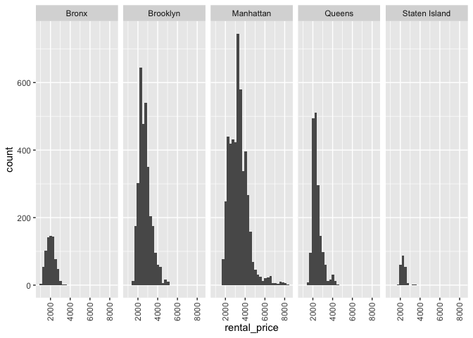

p8105_hw3_co2616
================
2025-10-13

``` r
library(tidyverse)
```

    ## ── Attaching core tidyverse packages ──────────────────────── tidyverse 2.0.0 ──
    ## ✔ dplyr     1.1.4     ✔ readr     2.1.5
    ## ✔ forcats   1.0.0     ✔ stringr   1.5.1
    ## ✔ ggplot2   3.5.2     ✔ tibble    3.3.0
    ## ✔ lubridate 1.9.4     ✔ tidyr     1.3.1
    ## ✔ purrr     1.1.0     
    ## ── Conflicts ────────────────────────────────────────── tidyverse_conflicts() ──
    ## ✖ dplyr::filter() masks stats::filter()
    ## ✖ dplyr::lag()    masks stats::lag()
    ## ℹ Use the conflicted package (<http://conflicted.r-lib.org/>) to force all conflicts to become errors

## Problem 1

loading instacart data

``` r
library(p8105.datasets)
data("instacart")
```

The `instacart` dataset has 1384617 observations and 15 variables and
tells us the order and product details of online grocery orders via
instacart in 2017. This dataset contains key variables such as
`product_name` which shows the name of the food products ordered,
`department` which describes the department the food product is
categorized under, `add_to_cart_order` which tells the order in which
the food product was added to the online cart, and `order_hour_of_day`
which tells the hour of the day in which the order was placed. The
average order number in which a food product was added to the cart is
8.7580443 and the median hour of the day in which a order was placed is
14.

``` r
instacart %>% 
  group_by(order_hour_of_day) %>% 
  ggplot(aes(x = order_hour_of_day)) +
  geom_histogram()
```

    ## `stat_bin()` using `bins = 30`. Pick better value with `binwidth`.

<!-- -->

**How many aisles are there, and which aisles are the most items ordered
from?**

``` r
instacart %>% 
  group_by(aisle) %>% 
  summarize(n_obs = n())
```

    ## # A tibble: 134 × 2
    ##    aisle                  n_obs
    ##    <chr>                  <int>
    ##  1 air fresheners candles  1067
    ##  2 asian foods             7007
    ##  3 baby accessories         306
    ##  4 baby bath body care      328
    ##  5 baby food formula      13198
    ##  6 bakery desserts         1501
    ##  7 baking ingredients     13088
    ##  8 baking supplies decor   1094
    ##  9 beauty                   287
    ## 10 beers coolers           1839
    ## # ℹ 124 more rows

``` r
instacart %>% 
  group_by(aisle) %>% 
  summarize(n_obs = n()) %>% 
  filter(min_rank(desc(n_obs)) <  4)
```

    ## # A tibble: 3 × 2
    ##   aisle                       n_obs
    ##   <chr>                       <int>
    ## 1 fresh fruits               150473
    ## 2 fresh vegetables           150609
    ## 3 packaged vegetables fruits  78493

There are 134 aisles and the top 3 aisles with the most items ordered
are fresh fruits (150,473 items), fresh vegetables (150,609 items), and
packaged vegetables fruits (78,493 items).

**Make a plot that shows the number of items ordered in each aisle,
limiting this to aisles with more than 10000 items ordered. Arrange
aisles sensibly, and organize your plot so others can read it.**

``` r
instacart %>% 
  group_by(aisle, department_id) %>% 
  summarize(n_obs = n()) %>% 
  filter(n_obs > 10000) %>% 
  ggplot(aes(x = aisle, y = n_obs)) +
  geom_col()
```

    ## `summarise()` has grouped output by 'aisle'. You can override using the
    ## `.groups` argument.

<!-- -->

**Make a table showing the three most popular items in each of the
aisles “baking ingredients”, “dog food care”, and “packaged vegetables
fruits”. Include the number of times each item is ordered in your
table.**

``` r
 instacart %>% 
  filter(aisle %in% c("baking ingredients", "dog food care", "packaged vegetables fruits")) %>% 
  group_by(aisle, product_name) %>% 
  summarise(n_obs = n()) %>%
  group_by(aisle) %>% 
  mutate(product_ranking = min_rank(desc(n_obs))) %>% 
  filter(product_ranking < 4) %>% 
  knitr::kable()
```

    ## `summarise()` has grouped output by 'aisle'. You can override using the
    ## `.groups` argument.

| aisle | product_name | n_obs | product_ranking |
|:---|:---|---:|---:|
| baking ingredients | Cane Sugar | 336 | 3 |
| baking ingredients | Light Brown Sugar | 499 | 1 |
| baking ingredients | Pure Baking Soda | 387 | 2 |
| dog food care | Organix Chicken & Brown Rice Recipe | 28 | 2 |
| dog food care | Small Dog Biscuits | 26 | 3 |
| dog food care | Snack Sticks Chicken & Rice Recipe Dog Treats | 30 | 1 |
| packaged vegetables fruits | Organic Baby Spinach | 9784 | 1 |
| packaged vegetables fruits | Organic Blueberries | 4966 | 3 |
| packaged vegetables fruits | Organic Raspberries | 5546 | 2 |

**Make a table showing the mean hour of the day at which Pink Lady
Apples and Coffee Ice Cream are ordered on each day of the week; format
this table for human readers (i.e. produce a 2 x 7 table).**

``` r
instacart %>% 
  filter(product_name %in% c("Pink Lady Apples", "Coffee Ice Cream")) %>% 
  group_by(product_name, order_dow) %>% 
  summarise(
    mean_hour = mean(order_hour_of_day, na.rm = TRUE)
  ) %>%
  pivot_wider(
    names_from = order_dow,
    values_from = mean_hour
  ) %>% 
  knitr::kable()
```

    ## `summarise()` has grouped output by 'product_name'. You can override using the
    ## `.groups` argument.

| product_name     |        0 |        1 |        2 |        3 |        4 |        5 |        6 |
|:-----------------|---------:|---------:|---------:|---------:|---------:|---------:|---------:|
| Coffee Ice Cream | 13.77419 | 14.31579 | 15.38095 | 15.31818 | 15.21739 | 12.26316 | 13.83333 |
| Pink Lady Apples | 13.44118 | 11.36000 | 11.70213 | 14.25000 | 11.55172 | 12.78431 | 11.93750 |

## Problem 2

loading and tidying zillow datasets

``` r
zip_df = 
   read_csv("zillow_data/Zip Codes.csv", na = c("NA", ".", "")) %>%
  janitor::clean_names() %>% 
  mutate(
    borough = case_match(
      county,
      "Bronx" ~ "Bronx",
      "Kings" ~ "Brooklyn",
      "New York" ~ "Manhattan",
      "Queens" ~ "Queens",
      "Richmond" ~ "Staten Island")) %>% 
  select(-county_fips, -state_fips, -county_code, -county, -file_date) %>%
  relocate(zip_code)
```

    ## Rows: 322 Columns: 7
    ## ── Column specification ────────────────────────────────────────────────────────
    ## Delimiter: ","
    ## chr (4): County, County Code, File Date, Neighborhood
    ## dbl (3): State FIPS, County FIPS, ZipCode
    ## 
    ## ℹ Use `spec()` to retrieve the full column specification for this data.
    ## ℹ Specify the column types or set `show_col_types = FALSE` to quiet this message.

``` r
zori_df = 
   read_csv("zillow_data/Zip_zori.csv", na = c("NA", ".", "")) %>%
  janitor::clean_names() %>% 
  rename(
    zip_code = region_name
  ) %>%
  pivot_longer(
    cols = x2015_01_31:x2024_08_31,
    names_to = "date",
    values_to = "rental_price",
    names_prefix = "x") %>% 
  select(-region_type, -state_name, -metro, -county_name, -size_rank) %>% 
  relocate(zip_code)
```

    ## Rows: 149 Columns: 125
    ## ── Column specification ────────────────────────────────────────────────────────
    ## Delimiter: ","
    ## chr   (6): RegionType, StateName, State, City, Metro, CountyName
    ## dbl (119): RegionID, SizeRank, RegionName, 2015-01-31, 2015-02-28, 2015-03-3...
    ## 
    ## ℹ Use `spec()` to retrieve the full column specification for this data.
    ## ℹ Specify the column types or set `show_col_types = FALSE` to quiet this message.

``` r
nyc_zillow_df = 
  left_join(zip_df, zori_df, by = "zip_code")
```

    ## Warning in left_join(zip_df, zori_df, by = "zip_code"): Detected an unexpected many-to-many relationship between `x` and `y`.
    ## ℹ Row 1 of `x` matches multiple rows in `y`.
    ## ℹ Row 4757 of `y` matches multiple rows in `x`.
    ## ℹ If a many-to-many relationship is expected, set `relationship =
    ##   "many-to-many"` to silence this warning.

**There are 116 months between January 2015 and August 2024. How many
ZIP codes are observed 116 times? How many are observed fewer than 10
times? Why are some ZIP codes are observed rarely and others observed in
each month?**

``` r
nyc_zillow_df %>%
  group_by(zip_code) %>%
  summarise(n_obs = n()) %>% 
  filter(n_obs == 116)
```

    ## # A tibble: 147 × 2
    ##    zip_code n_obs
    ##       <dbl> <int>
    ##  1    10001   116
    ##  2    10002   116
    ##  3    10003   116
    ##  4    10004   116
    ##  5    10005   116
    ##  6    10006   116
    ##  7    10007   116
    ##  8    10009   116
    ##  9    10010   116
    ## 10    10011   116
    ## # ℹ 137 more rows

``` r
nyc_zillow_df %>%
  group_by(zip_code) %>%
  summarise(n_obs = n()) %>% 
  filter(n_obs < 10)
```

    ## # A tibble: 171 × 2
    ##    zip_code n_obs
    ##       <dbl> <int>
    ##  1    10008     1
    ##  2    10020     1
    ##  3    10041     1
    ##  4    10043     1
    ##  5    10045     1
    ##  6    10047     1
    ##  7    10048     1
    ##  8    10055     1
    ##  9    10072     1
    ## 10    10080     1
    ## # ℹ 161 more rows

Between January 2015 and August 2024, there are 147 ZIP codes observed
116 times and there are 171 ZIP codes observed less than 10 times. Some
ZIP codes are observed rarely and others observed in each month because
the Zillow website shows available homes for sale or rent. So, if a home
was sold or rented out, it was probably removed from the website along
with the associated ZIP Code going forward.Thus the ZIP code for that
home would longer show up in the subsequent months on the Zillow
website.

**Create a reader-friendly table showing the average rental price in
each borough and year (not month). Comment on trends in this table.**

``` r
nyc_zillow_df %>% 
  drop_na(rental_price) %>% 
  separate(
    date, into = c("year", "month", "day")) %>% 
  group_by(borough, year) %>% 
  summarize(
  mean_rental_price = mean(rental_price, na.rm = TRUE)
  ) %>% 
  pivot_wider(
    names_from = borough,
    values_from = mean_rental_price
  )
```

    ## `summarise()` has grouped output by 'borough'. You can override using the
    ## `.groups` argument.

    ## # A tibble: 10 × 6
    ##    year  Bronx Brooklyn Manhattan Queens `Staten Island`
    ##    <chr> <dbl>    <dbl>     <dbl>  <dbl>           <dbl>
    ##  1 2015  1760.    2493.     3006.  2215.             NA 
    ##  2 2016  1520.    2520.     3015.  2272.             NA 
    ##  3 2017  1544.    2546.     3109.  2263.             NA 
    ##  4 2018  1639.    2547.     3160.  2292.             NA 
    ##  5 2019  1706.    2631.     3285.  2388.             NA 
    ##  6 2020  1811.    2555.     3091.  2316.           1978.
    ##  7 2021  1858.    2550.     3124.  2211.           2045.
    ##  8 2022  2054.    2868.     3753.  2406.           2147.
    ##  9 2023  2285.    3015.     3908.  2562.           2333.
    ## 10 2024  2497.    3126.     4053.  2694.           2536.

I noticed the average rental prices under Staten Island from the years
2015 through 2019 are missing. Manhattan has the highest average rental
prices compared to the other boroughs across all years and the Bronx has
the lowest average rental prices. The average rental prices in Queens
has stayed fairly consistent across the years compared to the other
boroughs.

**Make a plot showing NYC Rental Prices within ZIP codes for all
available years. Your plot should facilitate comparisons across
boroughs. Comment on any significant elements of this plot.**

``` r
nyc_zillow_df %>% 
  ggplot(aes(x = rental_price)) +
  geom_histogram() +
  facet_grid(. ~ borough) +
  theme(axis.text.x = element_text(angle = 90, hjust = 1, vjust = 0.5))
```

    ## `stat_bin()` using `bins = 30`. Pick better value with `binwidth`.

    ## Warning: Removed 7010 rows containing non-finite outside the scale range
    ## (`stat_bin()`).

<!-- -->

**Compute the average rental price within each ZIP code over each month
in 2023. Make a reader-friendly plot showing the distribution of
ZIP-code-level rental prices across boroughs; put differently, your plot
should facilitate the comparison of the distribution of average rental
prices across boroughs. Comment on this plot.**

``` r
nyc_zillow_df %>% 
  drop_na(rental_price) %>% 
  separate(
    date, into = c("year", "month", "day")) %>% 
  filter(year == 2023) %>% 
  group_by(borough, zip_code, month) %>% 
  summarize(
  mean_rental_price = mean(rental_price, na.rm = TRUE)
  ) %>% 
  ggplot(aes(x = month, y = mean_rental_price)) +
  geom_violin() +
  facet_grid(borough ~ .) +
  theme(axis.text.x = element_text(angle = 90, hjust = 1, vjust = 0.5))
```

    ## `summarise()` has grouped output by 'borough', 'zip_code'. You can override
    ## using the `.groups` argument.

<!-- -->

**Combine the two previous plots into a single graphic, and export this
to a results folder in your repository**
